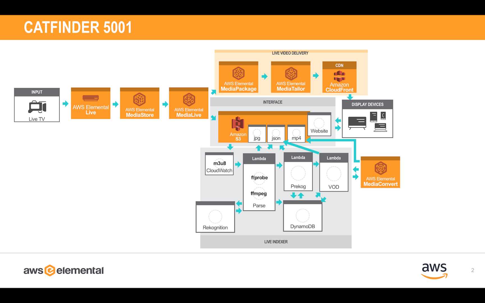
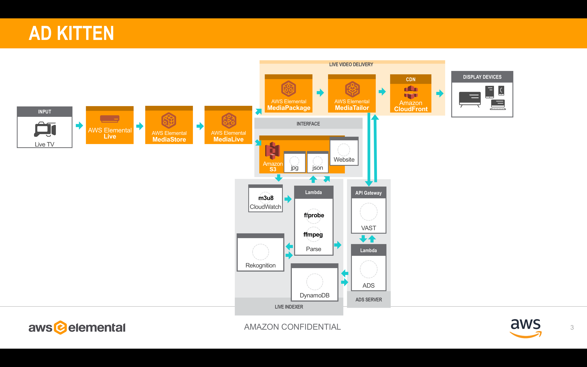
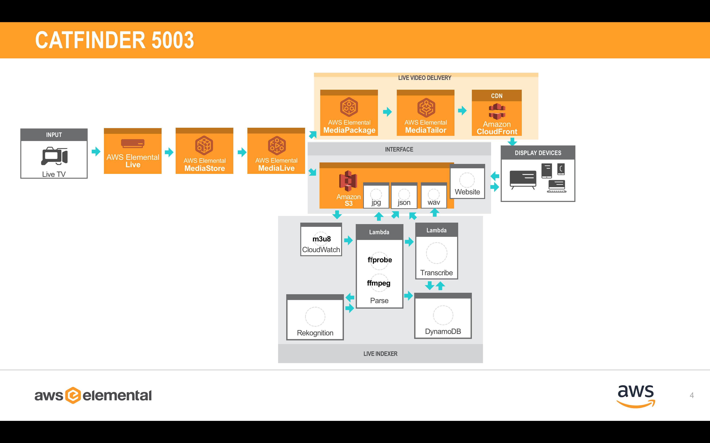

# Instant video highlights: build your own Live-to-VOD workflow with machine-learning image recognition

Demonstration of a frame accurate live-to-VOD solution with automatic machine-learning image recognition Introduction to the AWS services used to create the demonstration Explanation of how the services were combined to create a solution

## catfinder5001 "the original"

*Interested?* [Deployment Instructions](catfinder5001/)

This is a refactor of the original "catfinder 5000" shown at re:Invent 2017 that used AWS Elemental Delta to now use the new AWS Media Services. The OG CF5k required a polling technique on the HLS manifest, which now with CF5k1 we can use the seamless integration of AWS Elemental MediaLive with S3 and AWS Elemental MediaPackage in place of AWS Elemental Delta.

## catfinder5002 "Content Aware Ads"

*Interested?* [Deployment Instructions](catfinder5002/)

This is also known as "Ad Kitten" shown at CES2017, this uses the catfinder5001-parse's DynamoDB "summary" table with the catfinder5002-ads code that simulates an ADS server for AWS Elemental MediaTailor. The website is used to demostrate the end to end and is optional.

## catfinder5003 "Auomated Transcribe and Translate"

*Interested?* [Deployment Instructions](catfinder5003/)

This is an evolution of the OG catfinder5001 that includes the ability to extend analysis from visual ( Amazon Rekognition ) to audible ( Amazon Translate ). The transcription of the livestream is then thrown throw Amazon Translate and Amazon Comprehend and displayed in a nifty webpage interface. One could easily append an automation with these results, and that part is up to you!

## catfinder5004 "Automated Sports Clipping"

*Interested?* [Deployment Instructions](catfinder5004/)

This version uses the basis of catfinder5001-parse but is designed to monitor a scoreboard of a Hockey Livestream and make decisions based upon a "Goal" ( increase of score ) and a "Shot" ( increase of the shot clock ). This is a work in progress and was hardcoded for the NAB2018 demo. It was very scrappy and is not complete. I would not suggest using this as-is, but I am including the code as I make it more robust.

