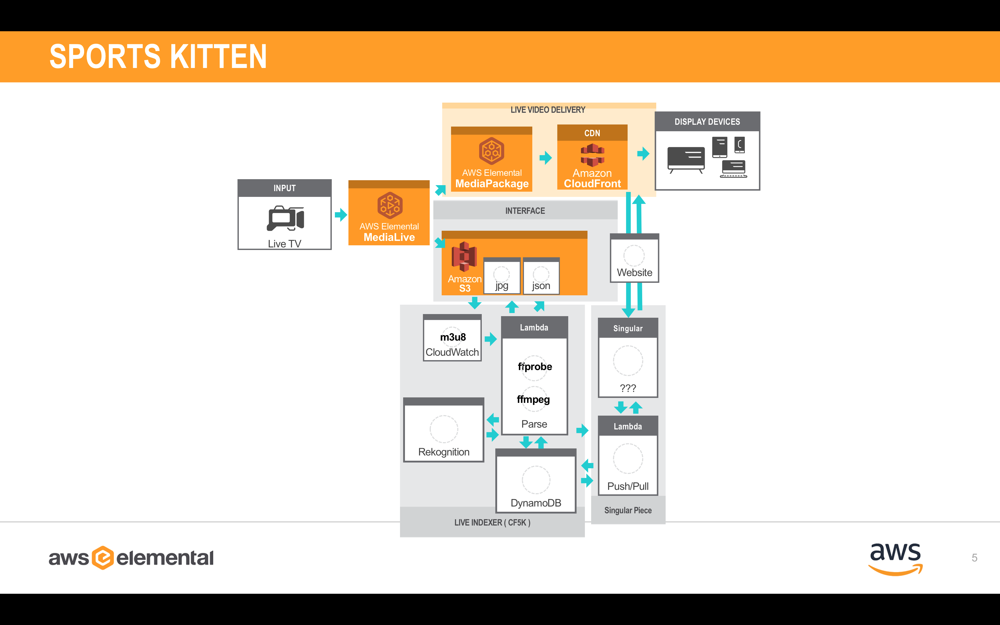

# catfinder5004 "Automated Sports Clipping"

This version uses the basis of catfinder5001-parse but is designed to monitor a scoreboard of a Hockey Livestream and make decisions based upon a "Goal" ( increase of score ) and a "Shot" ( increase of the shot clock ). This is a work in progress and was hardcoded for the NAB2018 demo. It was very scrappy and is not complete. I would not suggest using this as-is, but I am including the code as I make it more robust.

## How to Deploy

### Step-by-step

Instructions on how to create your own by hand.

#### Create S3 Bucket

You have two options:

1. Follow these ok instructions: [Catfinder5000 Static Webstite Hosting](../catfinder5000/LAB/1_StaticWebHosting/README.md)

2. You can ue my python script: [create_bucket.py](catfinder5004-createchannel/create_bucket.py)

#### Create MediaLive and MediaPackage Channels

You have two options:

1. Follow these awesome instructions: [AWS Live Streaming and Live-to-VOD Workshop](https://github.com/aws-samples/aws-media-services-simple-live-workflow)

1. If you already have solid IAM Roles, you can use my python script [create_channel.py](catfinder5004-createchannel/create_channel.py)

#### Create DynamoDB Tables

You have two options:

1. Follow these ok instructions: [Catfinder5000 DynamoDB](../catfinder5000/LAB/2_DynamoDB/README.md)

1. If you already have solid IAM Roles, you can use my python script [create_table.py](catfinder5004-createchannel/create_table.py)

#### Create Lambda Functions

You have two options:

1. Follow these ok instructions: [Catfinder5000 Lambda](../catfinder5000/LAB/3_Lambda/README.md)

1. Do your own method of deploying Lambdas. You can do what you want, I ain't the boss of you.

### Fully Automatic

#### CloudFormation Tempate

Standby... I'm ironing out the security policies. fun times...

## The Lambda Functions

### catfinder5004-parse

This is a heavy variation of catfinder5001-parse that has been hardcoded to specific content that was provided for NAB2018 at the AWS Elemental Booth.

Intrigued? [catfinder5004-parse code](catfinder5004-parse/)

### catfinder5004-website

this is a heavy variation of catfinder5004-website specific for the NAB2018 demo.

Intrigued? [catfinder5004-website code](catfinder5004-website/)
